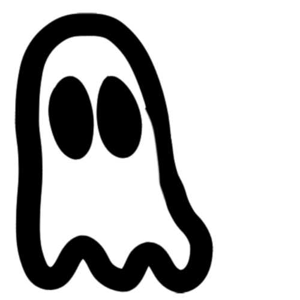
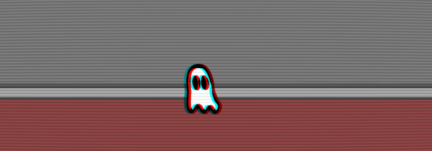

<p align="center"></p>
<h1 align="center">Ghostly</h1>
<p align="center">Um jogo de teste feito com Golang e PIXI.JS</p>




## :zap: O que é?
Era para ser um joguinho feito para o evento do Zuraaa! list, porém, devido a falta de tempo e problemas na vida pessoal de um dos autores virou outra coisa.

## :ghost: E que coisa é essa?
Ande por uma casinha como se voce fosse um fantasma. Não há nada, além do incrível andar de um fantasma

## :question: Como usar?
Use 
```cd %GOPATH%/src/github.com/acnologla/Ghostly```
Após isso, é bom garantir se tem o golang instalado e então utilizar
```revel run -a github.com/acnologla/Ghostly```
Após isso, é necessario ligar o VUE em Development para teste com 
```cd ./assets```
e
``
npm run dev
``
e acessar
``localhost:8080/rooms``
